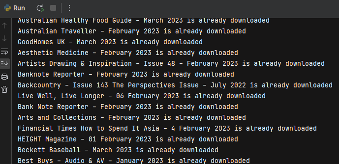
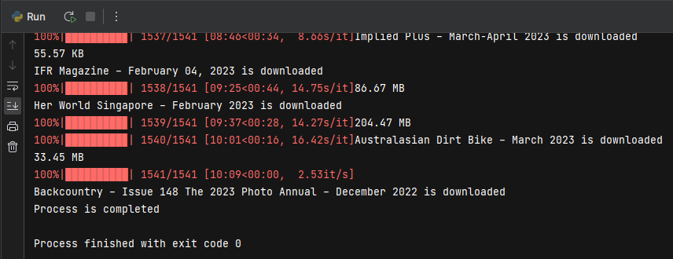

# Project Title

Magazine Library

## Table of Contents

- [Description](#description)
- [Technologies Used](#technologies-used)
- [Background](#background)
- [Features](#features)
- [FAQ](#faq)
- [Roadmap](#roadmap)
- [Sponsorship and Funding](#sponsorship-and-funding)

# Description

This project helps to automatically download many popular, paid (at least expensive in my country) and foreign magazines around the world.

# Technologies Used

### This project created with:

* selenium
* numpy
* tdqm
* requests

# Background

I made this automation software because many quality magazines are not available for sale in my area. Even if it is offered for sale, it cannot be accessed due to the economic conditions of the country. I have prepared this software in order to be able to follow the journals that I follow from time to time, daily and up-to-date. In this way, by running this software once a day, I can download all the currently published magazines.

# Features

* As the algorithm works, each new magazine is checked and recorded after a certain period in order to prevent possible re-downloads before downloading.
* * 

---

* * 

---

* * 

# FAQ

**1. Where is the code file ?**

**2. How can i reach the program ?**

# Roadmap

### For possible improvements:

1. Timer can be added for Windows or Linux users. In this way, the program will run itself at the specified times without the need to run a file manually.
2. By registering in a database, a site can be created (the program is taken live) and thus users can access any journal they want, like an open library.

# Sponsorship and Funding 

Hi there!

I'm a solo developer who created this nifty automation software to solve a pesky problem I had - not being able to get my hands on my favorite magazines. Sure, they might be available for sale, but the economic conditions in my area make it difficult to justify the cost. So I took matters into my own hands and developed this software to help me stay up-to-date on the latest articles and issues.

Now, with just one click, I can download all the magazines I want, anytime and anywhere. No more waiting in line at the store, no more worrying about missing out on the latest trends. This software has been a game-changer for me and I'm sure it can be for you too.

So if you're tired of missing out on your favorite publications or just looking for a more convenient way to stay informed, give this software a try. You won't be disappointed!
